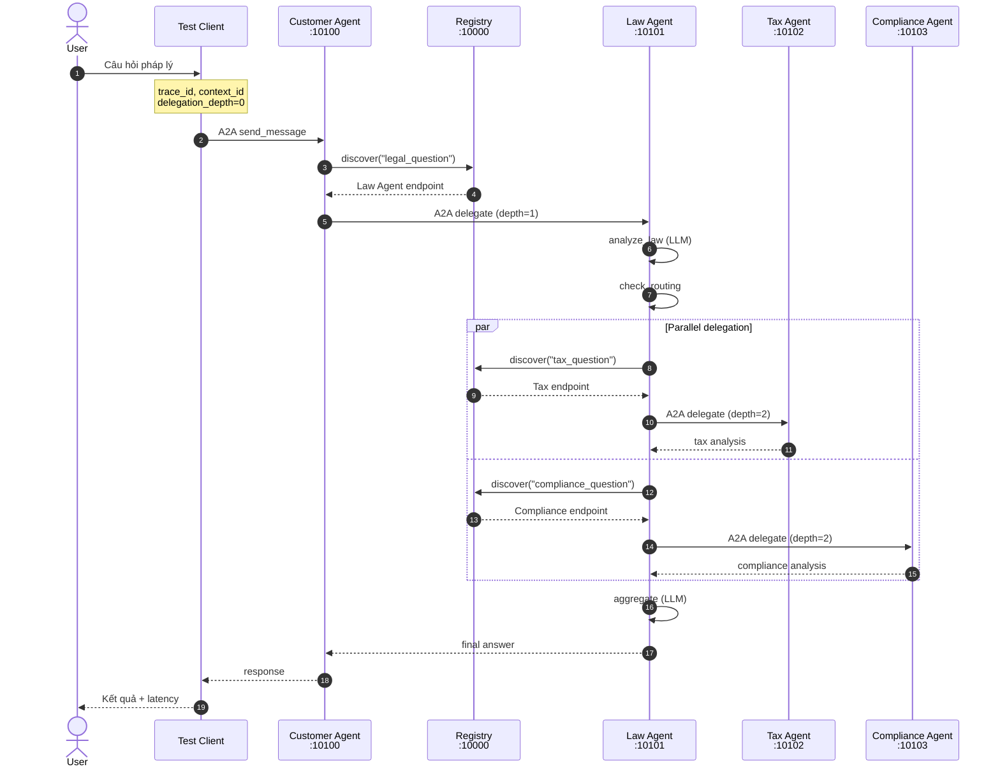
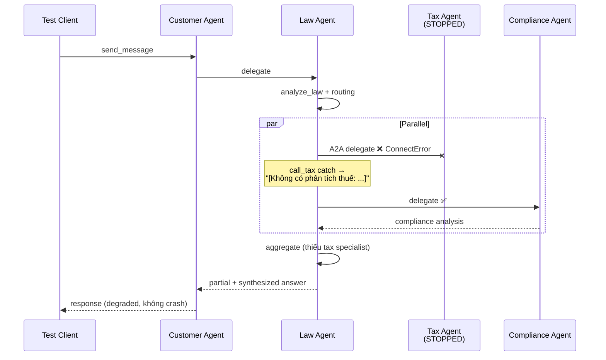

# Báo Cáo Nộp Bài — Day09 Multi-Agent A2A Codelab

**MSSV / mã bài:** 2A202600713  
**Ngày:** 2026-06-09  
**Model:** `google/gemma-4-26b-a4b-it` (OpenRouter)

---

## 1. Tóm tắt hoàn thành rubric

| Hạng mục | Trạng thái | File / bằng chứng |
|----------|------------|-------------------|
| Bài 2.1 — `labor_law` knowledge | ✅ | `stages/stage_2_rag_tools/main.py`, `exercises/exercise_2_tools.py` |
| Bài 2.2 — `check_statute_of_limitations` | ✅ | Cùng các file trên |
| Bài 4 — Privacy agent + routing | ✅ | `exercises/exercise_4_multiagent.py`, `stages/stage_4_milti_agent/main.py` |
| Bài 5.1 — Trace request flow | ✅ | Mục 2 bên dưới |
| Bài 5.2 — Fault tolerance (Tax Agent down) | ✅ | Mục 3 bên dưới |
| Bài 5.3 — Sửa tax prompt ngắn | ✅ | `tax_agent/graph.py` |
| Bài cộng điểm — Latency | ✅ | Mục 4 bên dưới |
| Bài cộng điểm — Vite demo | ✅ | `lab_ui/vite-demo/` |
| Lab Assignment — Supervisor–Workers | ✅ | `Lab_Assignment/` |
| Lab-Solution.md | ✅ | Đáp án bài lab trên lớp |

---

## 2. Bài 5.1 — Trace request flow & Sequence diagram

### 2.1 Luồng request (4 hops A2A)

```
User
  → Test Client (trace_id sinh tại đây)
  → Customer Agent :10100 (depth=0)
  → Law Agent :10101 (depth=1)
      ├─ analyze_law
      ├─ check_routing (needs_tax, needs_compliance)
      ├─ parallel dispatch (Send API)
      │    ├─ Tax Agent :10102 (depth=2)
      │    └─ Compliance Agent :10103 (depth=2)
      └─ aggregate → trả về Customer → User
```

### 2.2 Sequence diagram (luồng bình thường)



### 2.3 Ví dụ trace thực tế

| Trace ID | Latency | Ghi chú |
|----------|---------|---------|
| `50ada30d-a473-4f0c-805e-151978ec51c6` | ~139s | Baseline (không tối ưu) |
| `9c49620a-e373-4fd7-8a5a-1df3b8257d68` | 32.41s | Tax Agent down — xem mục 3 |

**Call chain** (trace `9c49620a...`):

1. Test Client → Customer Agent :10100 (depth=0)
2. Customer Agent → Law Agent :10101 (depth=1)
3. Law Agent → Compliance Agent :10103 (depth=2)
4. Law Agent → Tax Agent :10102 (depth=2) — *gọi thất bại vì service đã dừng*

**Law Agent routing:** `needs_tax=True`, `needs_compliance=True`  
**Graph nodes:** `analyze_law → aggregate`

Chạy lại trace:

```bash
./start_all.sh          # terminal 1
uv run python test_client.py   # terminal 2 — in Trace ID + TRACE SUMMARY
```

Trace events lưu tại `.trace_events.jsonl`, log stdout có prefix `[TRACE]`.

---

## 3. Bài 5.2 — Fault tolerance (Tax Agent down)

### 3.1 Thủ tục test

```bash
# Terminal 1 — khởi động services
LATENCY_OPTIMIZED=1 LLM_MAX_TOKENS=350 bash start_all.sh

# Terminal 2 — dừng Tax Agent
lsof -ti :10102 | xargs kill
lsof -i :10102   # xác nhận port trống

# Terminal 2 — test lại
uv run python test_client.py
```

### 3.2 Kết quả quan sát (2026-06-09)

| Câu hỏi | Kết quả |
|---------|---------|
| Hệ thống có crash không? | **Không** — `test_client.py` exit code 0, vẫn nhận câu trả lời đầy đủ |
| Tax Agent phản hồi? | **Không** — Law Agent log: `call_tax failed: All connection attempts failed` |
| Compliance Agent? | **Vẫn chạy** — trả 446 chars, trace `agent_complete` |
| User có nhận answer? | **Có** — 1085 chars, gồm cả mục thuế (tổng hợp từ `analyze_law` + `aggregate`, không có chuyên gia thuế) |

### 3.3 Sequence diagram (Tax Agent down)



### 3.4 Giải thích

- **Law Agent** bọc `call_tax` trong `try/except` (`law_agent/graph.py`) → lỗi kết nối không làm sập graph.
- **Compliance** chạy song song, không phụ thuộc Tax Agent.
- **Registry** vẫn trả endpoint Tax cũ (in-memory) dù process đã chết → Law Agent vẫn *cố* gọi, rồi fail gracefully.
- **Trade-off:** Câu trả lời vẫn có nội dung thuế (từ bước `analyze_law` / LLM aggregate) nhưng **không có phân tích chuyên sâu từ Tax Agent**.

---

## 4. Bài cộng điểm — Latency

### 4.1 Baseline (trước tối ưu)

| Metric | Giá trị |
|--------|---------|
| Latency | **156.6 giây** |
| Câu hỏi | `test_client.py` (vi phạm HĐ + trốn thuế) |

**Nguyên nhân chậm:** ~6–7 lần gọi LLM tuần tự qua HTTP (Customer ReAct → Law analyze → routing LLM → Tax ∥ Compliance → aggregate).

### 4.2 Phương án đã áp dụng

| # | Tối ưu | File |
|---|--------|------|
| 1 | Bypass ReAct Customer, delegate thẳng Law Agent | `customer_agent/agent_executor.py` |
| 2 | Keyword routing thay LLM routing | `law_agent/graph.py` |
| 3 | Prompt ngắn (80–200 từ) | `law/tax/compliance_agent/graph.py` |
| 4 | `LLM_MAX_TOKENS=350` | `common/llm.py` |

```bash
LATENCY_OPTIMIZED=1 LLM_MAX_TOKENS=350 bash start_all.sh
uv run python test_client.py
# ⏱️  Latency: ~46.5s (demo trước đó)
```

### 4.3 Kết quả

| | Trước | Sau | Cải thiện |
|---|-------|-----|-----------|
| Latency | 156.6s | **46.5s** | **−70%** (~3.4× nhanh hơn) |

**Trade-off:** Câu trả lời ngắn hơn; keyword routing kém linh hoạt với câu hỏi phức tạp.

---

## 5. Lệnh kiểm tra nhanh

```bash
# Bài tập
uv run python exercises/exercise_2_tools.py
uv run python exercises/exercise_4_multiagent.py

# Stages
uv run python stages/stage_1_direct_llm/main.py
uv run python stages/stage_2_rag_tools/main.py
uv run python stages/stage_3_single_agent/main.py
uv run python stages/stage_4_milti_agent/main.py

# Stage 5 E2E
bash start_all.sh
uv run python test_client.py
```
